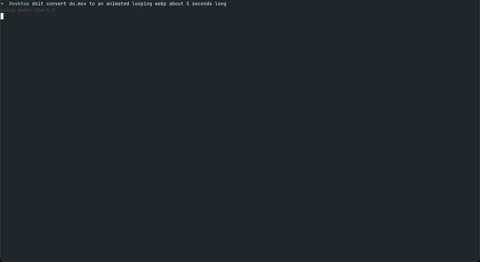

# do

A super-minimal terminal coding agent built with Go + [Bubble Tea](https://github.com/charmbracelet/bubbletea).



~1000 loc, ~7mb binary, <200tok system prompt, runs on a potato and looks good doing it.

Four tools, that's it:

- `read_file(path, start_line?, end_line?)`
- `edit_file(path, old_string, new_string)`
- `write_file(path, content)`
- `shell(command)`

Talks to any OpenAI-compatible chat completions endpoint (OpenAI, OpenRouter, Ollama, Z.ai, ...).

## Should I Use This?

Honestly, probably not. What you _should_ do is vibe code your own harness that does exactly what you need it to do and nothing more. Feel free to point your agent at this repo to get it started.

## Build

```sh
go build -o do
```

## Configure

```sh
export DO_BASE_URL=https://api.openai.com/v1   # default
export DO_API_KEY=sk-...
export DO_MODEL=gpt-4o                          # default
```

Point `DO_BASE_URL` at a local server (e.g. `http://localhost:11434/v1` for Ollama, `http://localhost:1234/v1` for LM Studio) and drop the key.

## AGENTS.md

Every AGENTS.md up the file tree gets loaded. This is the primary way to configure the agent. 

Rather than building plugins or extensions or prompt templates, write scripts and markdown files and mention them in `~/AGENTS.md` or `~/project/AGENTS.md`.

### CLI mode

Pass a prompt as arguments to run a single turn without launching the TUI:

```sh
./do fix the typo in main.go
```

Output goes to stdout with the same styling. The session is saved just like interactive mode, so you can resume it later with `./do` or subsequent CLI mode runs.

### Session

Sessions auto-save to `.do-session` in the working directory and resume on next launch. Delete `.do-session` to start fresh.

## Layout

```
┌─ status bar (do - path (branch) - model - token usage)
├─ viewport (conversation: you / assistant / tool calls / results)
├─ divider
└─ textarea input
```
